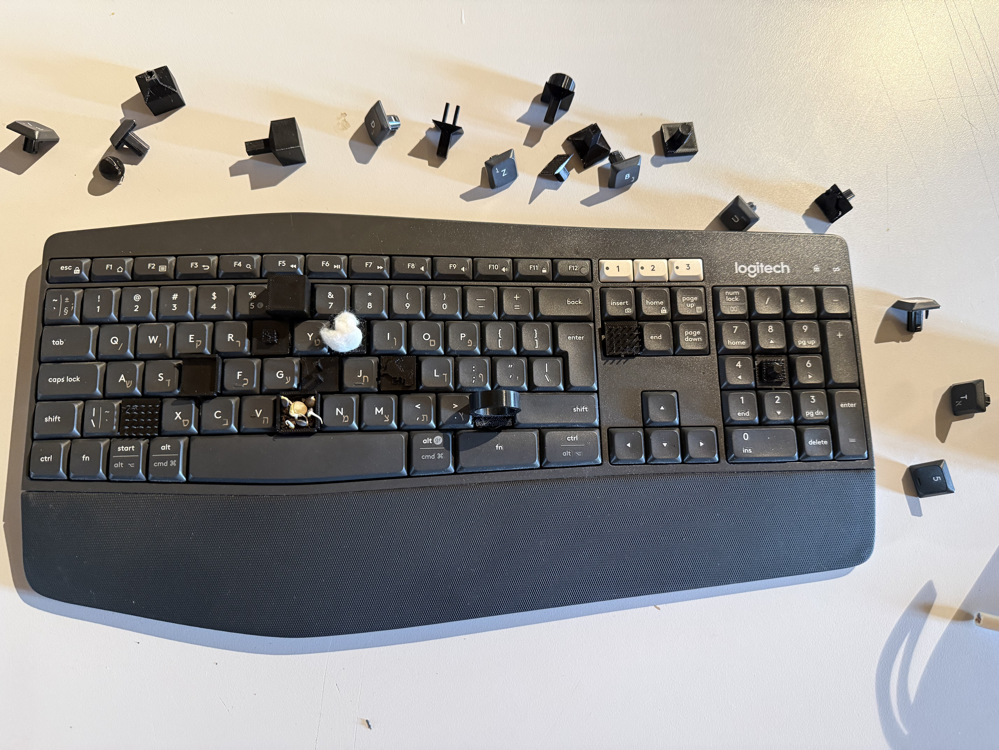

# Object of Thought

An ongoing research exploration of **objects, language, and material agency**.

This repository documents a series of experimental investigations into how objects speak—through their form, affordances, resistance, and the meanings we inscribe upon them. Rather than fixed designs, each phase asks a question: *What does this object reveal about thinking, interaction, or the nature of things themselves?*

---

## Phase 1: Invasive Grid

**The Question:** How does a grid—typically a neutral framework for ordering space—become invasive when applied to organic, three-dimensional form?

In this phase, we explored the tension between computational precision and material resistance. A gridded structure was imposed onto found objects and spaces, asking: *Does the grid reveal or obscure what the object is?* Does the mathematical order liberate or constrain the object's agency?

The research examined:
- Grid as a colonizing force on natural form
- Material response to computational order
- The political and poetic dimensions of spatial systems
- Documentation as a means of revealing hidden structures

**Explore:** See [`assignment_1_invasive_grid/`](./assignment_1_invasive_grid/) for full documentation, models, and process notes.

---

## Phase 2: Affordance & Keyboard

**The Question:** What hidden languages does the keyboard embody? Can we make visible the assumed, invisible structures that mediate our interaction with digital and physical worlds?

This phase investigated *affordance*—the qualities that invite or suppress action. By isolating and exaggerating the tactile and conceptual affordances of a keyboard, we asked: *What does this ordinary object teach us about control, intention, and the gap between what we intend to express and what the machine permits?*

The research examined:
- Haptic language and tactile feedback as communication
- The politics of constraint (what the keyboard refuses)
- Digital-to-physical translation and loss
- Objects as repositories of cultural assumptions

**Explore:** See [`assignment_2_affordance_keyboard/`](./assignment_2_affordance_keyboard/) for full technical documentation, 3D models, fabrication specs, and research notes.

---

## Methodology

Each phase follows a research-making cycle:

1. **Conceptual framing** — What question drives this work?
2. **Material investigation** — What does the object reveal through making?
3. **Documentation** — How do we capture and communicate findings?
4. **Iteration** — What does failure teach us?

Documentation includes sketches, photographs, 3D models, code, and reflective notes. We treat objects and algorithms as equally valid forms of thinking.

---

## Ongoing Research

As this course progresses, new phases will explore:
- The temporality of objects
- Objects in transition (decay, repair, loss)
- Language embedded in material
- Networks of meaning between objects

Check back for Phase 3 and beyond.

---

## Technical Notes

- **3D Models:** Found in `assignment_2_affordance_keyboard/models/` — ready for fabrication or inspection
- **Media:** High-resolution documentation in `presentation_pics/` folders
- **Specifications:** Design and fabrication details in respective `spec/` folders
- **Source Code:** Any generative or technical work in `src/` directories

---

## Exhibition Context

This work is presented as a research archive suitable for:
- Academic presentation and critique
- Gallery or museum documentation display
- Portfolio and educational contexts
- Ongoing experimental practice

---

**Maayan Magen**  
Bezalel Academy of Arts and Design, Jerusalem  
2024–2025

---

*"Objects are not mute. They speak through their form, their weight, their refusal. The act of making is an act of listening."*
