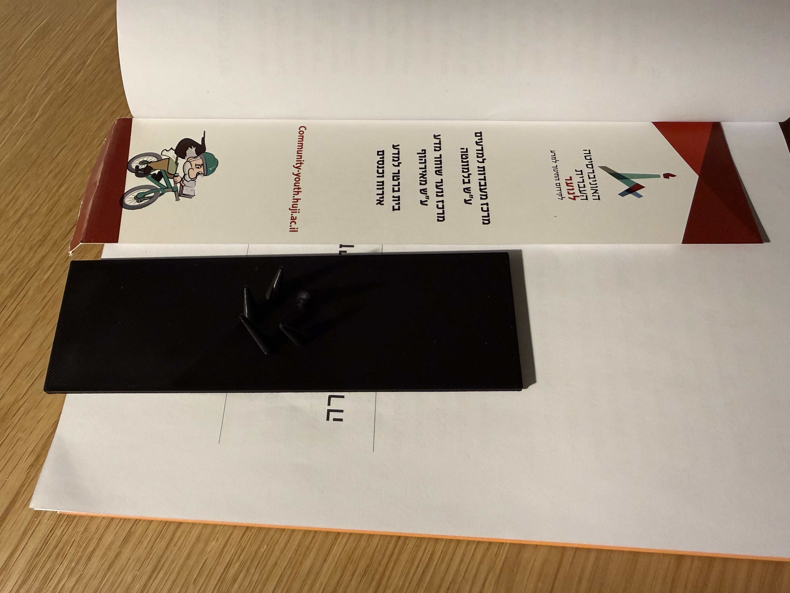
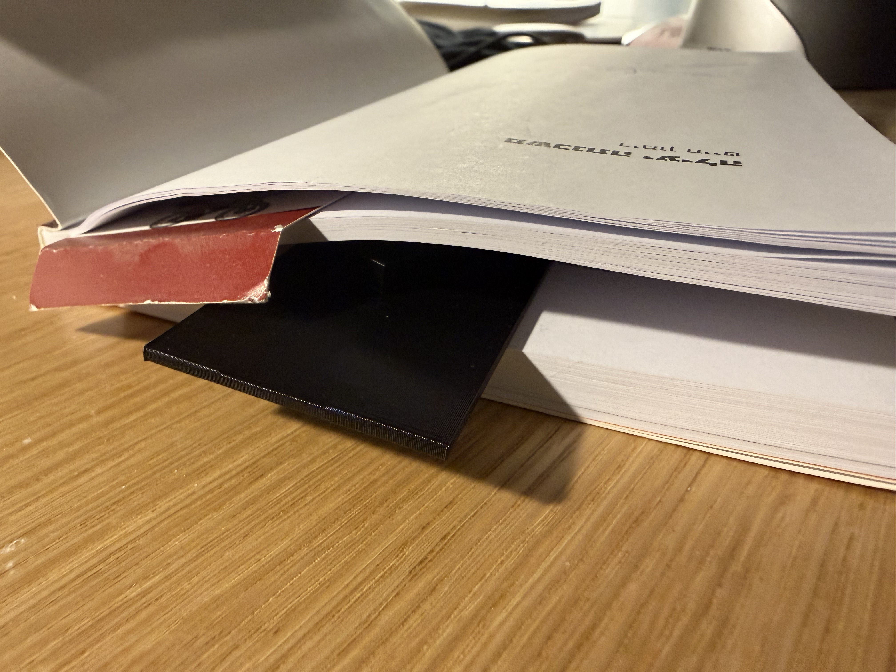
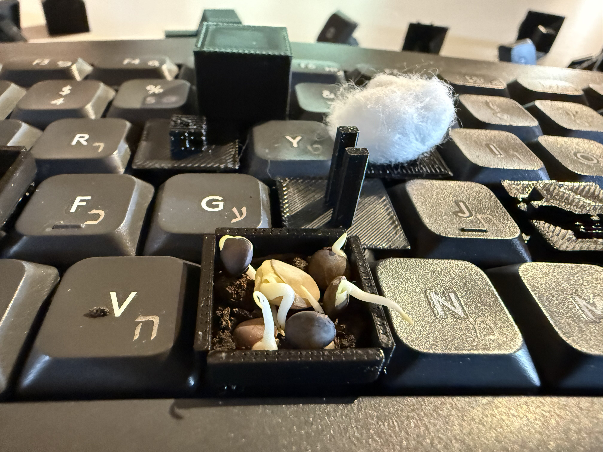
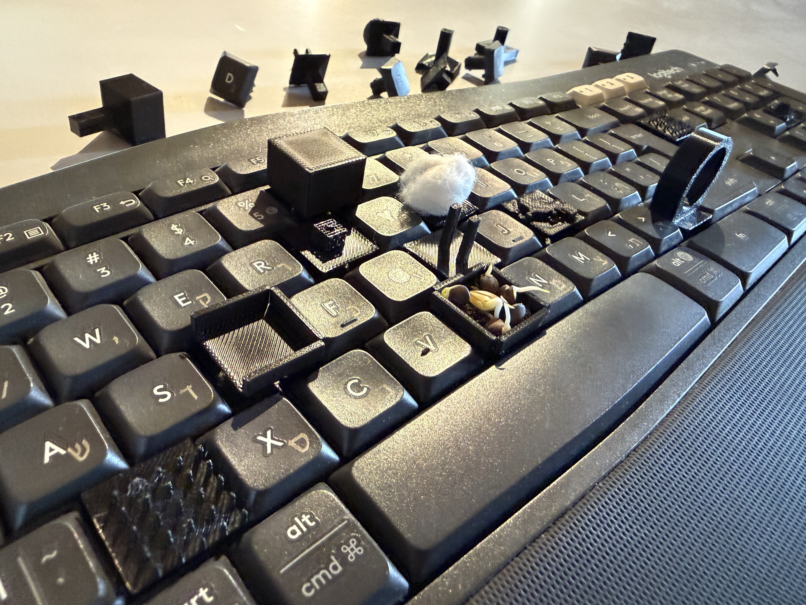

# Object of Thought

An ongoing research exploration of **objects, language, and material agency**.

This repository documents a series of experimental investigations into how objects speak—through their form, affordances, resistance, and the meanings we inscribe upon them. Rather than fixed designs, each phase asks a question: *What does this object reveal about thinking, interaction, or the nature of things themselves?*

---

## Phase 1: The Mutant Bookmark (Invasive Grid) ✓ LIVE

**The Object:** The bookmark—the most submissive, invisible object in a reader's ecology.

**The Question:** What happens when we transform the bookmark from a silent servant into an aggressive architectural parasite? How does parametric generation reveal the hidden potential in the most mundane form?

In this phase, we 3D-printed 15 mutant bookmarks in three evolutionary species, inserted them at prime-numbered pages, and asked: *At what point does the tool consume its host? What does the bookmark teach us about constraint, utility, and resistance?*

**Explore:** See [`assignment_1_invasive_grid/`](./assignment_1_invasive_grid/) for:
- Full concept documentation and research essay
- Blender Python generators (3 species × 5 variations)
- All 15 3D-printed STL models
- Technical specifications and assembly guide
- 8 process photographs in `presentation_pics/`

---

## Phase 2: Affordance & Keyboard (K850) ✓ LIVE

**The Object:** The Logitech K850 keyboard—a tool so transparent we forget we're using it.

**The Question:** What if we made the affordances of the keyboard visible by *breaking* them? By designing 8 keycap variants that each demand a different gesture, can we reveal what the standard form usually conceals?

This phase created 8 3D-printed keycap variants for the Logitech K850, each with a distinct affordance: grasp, pull, slide, pinch, target, balance. We asked: *How do shapes teach hands? What does the keyboard refuse to let us express?*

**Explore:** See [`assignment_2_affordance_keyboard/`](./assignment_2_affordance_keyboard/) for:
- Complete affordance theory and research documentation
- All 8 keycap variants (3D models and specifications)
- Technical specifications with scissor-switch research
- Parametric design and fabrication guides
- 7 presentation photographs in `presentation_pics/`

---

## Methodology

Each phase follows a research-making cycle:

1. **Conceptual framing** — What question drives this work?
2. **Material investigation** — What does the object reveal through making?
3. **Documentation** — How do we capture and communicate findings?
4. **Iteration** — What does failure teach us?

Documentation includes sketches, photographs, 3D models, code, and reflective notes. We treat objects and algorithms as equally valid forms of thinking.

---

## Image Gallery

### Phase 1: Mutant Bookmarks

  
  

All 8 presentation images in `assignment_1_invasive_grid/presentation_pics/`

### Phase 2: Affordance Keycaps

  
  

All presentation images in `assignment_2_affordance_keyboard/presentation_pics/`

---

## Ongoing Research

As this course progresses, new phases will explore:
- The temporality of objects
- Objects in transition (decay, repair, loss)
- Language embedded in material
- Networks of meaning between objects

Check back for Phase 3 and beyond.

---

## Technical Notes

- **3D Models:** Found in respective project folders
- **Media:** High-resolution documentation in `presentation_pics/` folders
- **Specifications:** Design and fabrication details in each phase's README
- **Source Code:** Generative and technical work in `src/` directories

---

## Exhibition Context

This work is presented as a research archive suitable for:
- Academic presentation and critique
- Gallery or museum documentation display
- Portfolio and educational contexts
- Ongoing experimental practice

---

**Maayan Magen**  
Bezalel Academy of Arts and Design, Jerusalem  
2024–2025

---

*"Objects are not mute. They speak through their form, their weight, their refusal. The act of making is an act of listening."*
